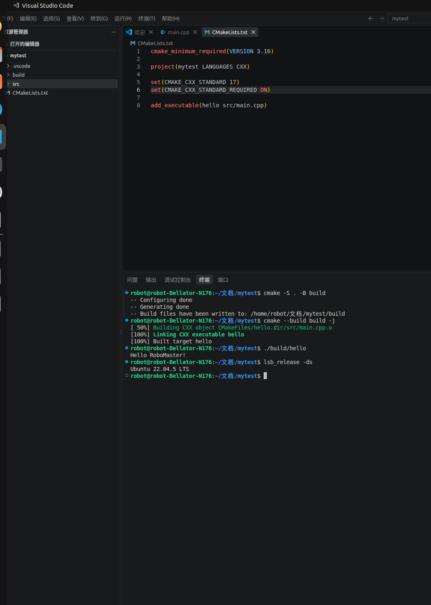

# mytest

## 项目简介
This is my first test in robomaster.It's about an easiest C++ program.

## 环境信息
- Ubuntu 22.04.5 LTS
- cmake version 3.22.1
- g++ 11.4.0

## 运行结果


## 作者与日期
```
姓名：林国伟
学号：2255116042
日期：2026年9月22日
```
